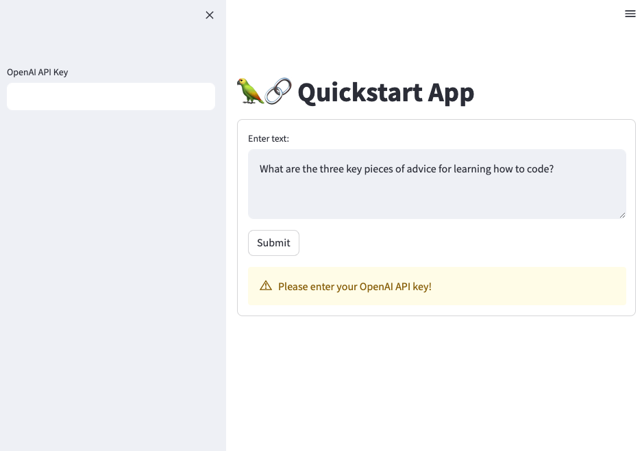

# Quickstart Streamlit App with LangChain on Heroku



A Python web application using Streamlit as the frontend and leveraging the capabilities of OpenAI GPT. This app prompts for a question and returns an AI-generated response.

## Deploy

[](https://heroku.com/deploy)

## Features

- Streamlit based frontend.
- OpenAI language model for generating responses.

## Installation

Clone this repository locally :

```bash
git clone https://github.com/your-github-username/quickstart-app.git
```

You will need Python 3.6+ installed on your machine. You can then install the necessary packages by running :

```bash
pip install -r requirements.txt
```

## Usage

Before you can use the application, you need to obtain your OpenAI API key. You can get this key from the OpenAI website after registering.

To start the application, navigate to the directory containing the app and run:

```bash
streamlit run app.py
```

You will then be able to access the application from your web browser at the following URL: `http://localhost:8501`

On the left sidebar, enter your OpenAI API key. In the main area, you can enter a question or statement you'd like a response to.

Click on 'Submit' to get the AI-generated response. If the OpenAI API key is not valid, you will receive a warning.

## How it works

The application leverages the OpenAI API to generate responses to text input. This is handled by the `generate_response()` function. The API key for OpenAI is input in the sidebar. The application also checks the validity of the key before processing the input.

## Contributing

Pull requests are welcome. For major changes, please open an issue first to discuss what you would like to change.

## License

[MIT](https://choosealicense.com/licenses/mit/)
